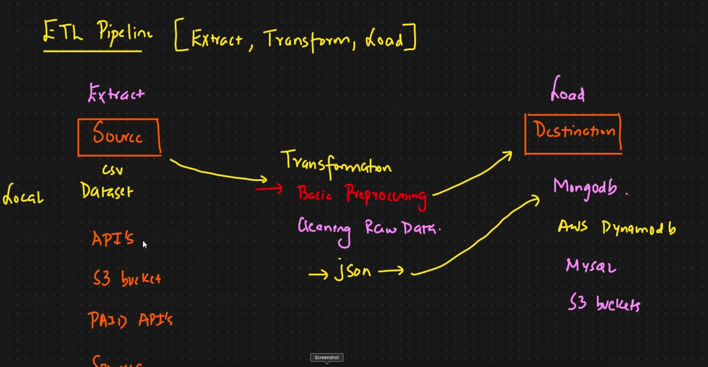

# NetworkSecurityProject for Phishing Data

##Data: 
We downloaded Phisphing Data from Intenernet and is present in Networ_Data folder

## ETL Pipeline: Extract, Transform, Load

Step1: Extraction: We read data from multiple data sources and store it locally
Step2: Transformation
* It invovles basic preprocessing
* It involved cleaning raw data
* It invovles combining data into a single dataframe as a .json for loading purpsoses to mongodb data base
Step3: Loading
We load it into a database in our case Mongodb Atlas Cloud

### Data Ingestion:

The Data Ingestion component is responsible for initiating and executing the data retrieval process. It reads raw data from MongoDB, processes it for ML tasks, and splits it into training and testing datasets. The ingestion component creates a **DataIngestionArtifact**, which contains the paths to the processed train and test datasets.

#### Configuration
* **DataIngestionConfig**: Configures the Data Ingestion component by defining the data sources, output paths, and any parameters required to perform the data ingestion.
* **DataIngestionArtifact**: Serves as the output from the ingestion process, housing the **train_file_path** and **test_file_path** that are passed to subsequent components.
  
#### Data Ingestion Process
The steps involved in the Data Ingestion process are:

1. **export_collection_as_dataframe()**:
   * Reads data directly from MongoDB and returns it as a Pandas DataFrame, enabling further processing.
2. **export_data_into_feature_store**:
   * Stores the retrieved data into a feature store, making it accessible for transformation and modeling stages.
3. **split_data_as_train_test**:
   * Splits the data from the feature store into training and testing datasets, preparing it for machine learning tasks.

#### Running Data Ingestion:

    To run the data ingestion component, execute the main.py file which configures and runs the Data Ingestion process, initializing it through DataIngestionConfig and capturing its output in the DataIngestionArtifact.

### Data Validation:

### Note:

* Each component, including Data Ingestion, outputs an artifact, encapsulated within artifact_entity.py.
* Input configurations for each component are managed via respective config_entity classes, ensuring modularity and reusability.

